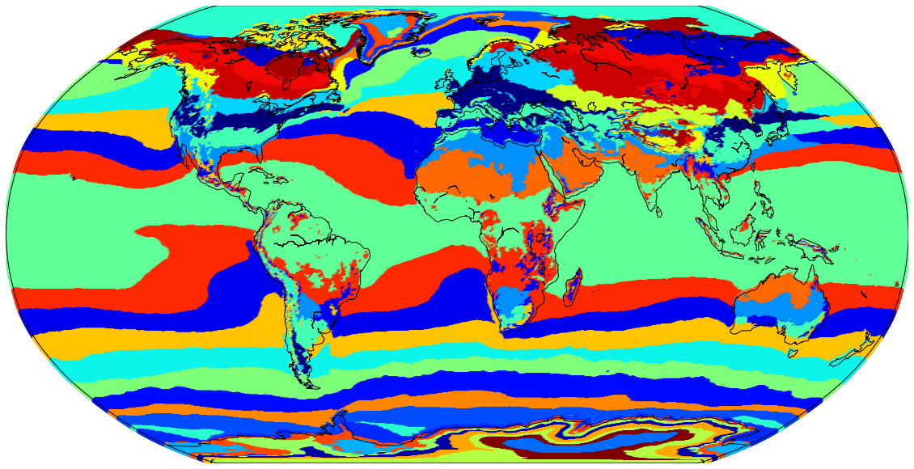
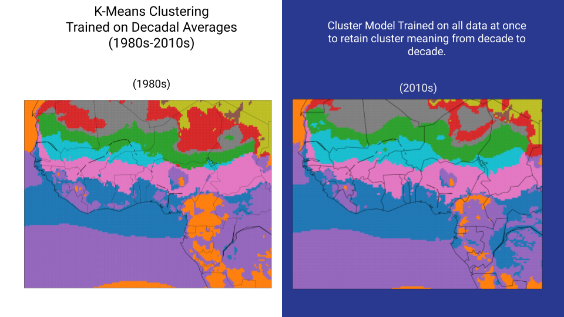
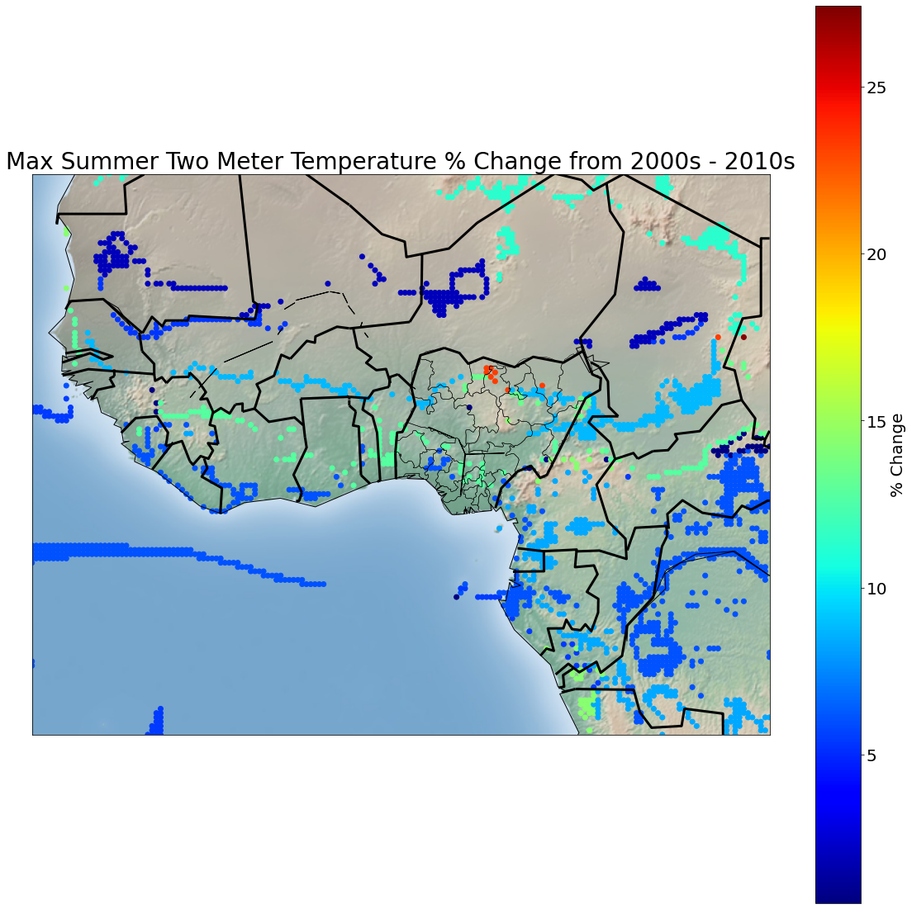
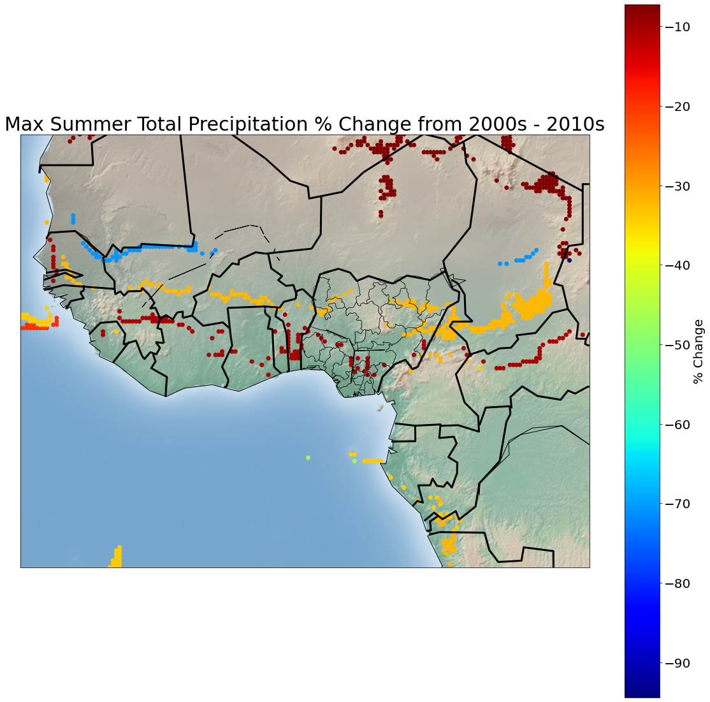

# Unsupervised Analysis of Climate Change in West Africa
---
---
* For a brief overview of the project (5 mins), please visit [this video presentation](https://www.youtube.com/watch?v=Cg3w6PVXA5g&t=49s)
* For a more in depth presentation (10 mins), please visit [this video presentation](https://www.youtube.com/watch?v=vuWzUiS3gaM&t=423s)

## Problem
---
*Bobban Gonna Farmer*, a smallholder farm aid group funded by the Peace Corps has reached out to 65,000 farmers in the past 10 years. By 2025, They want to expand to help over 1 million farmers in Nigeria. However, with limited resources, how should they prioritize the allocation of their resources?

## Solution
---
One factor to consider when allocating resources is how and by how much the climate has changed. By tracking each unique case of climate change, we can make an informed decision on which areas are most impacted by a changing climate. 

## Table Of Contents
---
 * [load_data.ipynb](load_data.ipynb) : Used the CDS API to download climate data.
 * [feature_engineering_global.ipynb](feature_engineering_global.ipynb) : Koppen inspired feature engineering on entire globe for proof of concept.
 * [global_clustering.ipynb](global_clustering.ipynb) : A proof of concept by clustering on the entire globe and comparing it to the Koppen Climate System. See below for a beautiful map!
 * [feature_engineering_Africa](feature_engineering_Africa.ipynb): Koppen inspired feature engineering on West Africa.
 * [africa_eda.ipynb](africa_eda.ipynb) : Pre clustering EDA on major Nigerian agricultural producing states.
 * [africa_clustering.ipynb](africa_clustering.ipynb) : Clustering on West Africa and Analysis of Clusters. Analysis includes:
     * Tracking relative size of clusters over time
     * Map of the percentage change of the mean max summer temperature and mean max summer precipitation values of each cluster. Map of each below.
     
* [figures](figures) : Saves of some relavent images for my presentation
* [shapefiles](shapefiles) : State border information for all of the states inside of Nigeria.
     
### The Devil is in the Details
---
Measuring how much the climate changed is much more difficult than tracking meteorological changes because climate is a phenomenon that persists over large areas of land and each climate has features that persist over time. The Koppen Climate Classification system considers features that persist over time by keeping track of seasonal values for both temperature and precipitation. Some of the values include summer max temperature, winter mean precipitation, etc. The problem with the Koppen system is that it uses *predefined conditions* to determine zone membership. Instead I take an *Unsupervised* approach by using KMeans clustering on the same features that the Koppen System considers to let the data speak for itself. One major benefit of this approach is the lack of rigidity of scale, I can use this unsupervised approach on the entire globe, or on a specific subset of the globe, ie West Africa. If clustering over space and time, the clusters should, in theory, show relevant climate zones by considering regional and temporal effects. 

     
## Global Clustering Map
---
 
 

## West Africa Clustering Map
---

## Maps of Percentage Change for analysis of Cluster Movement
---

